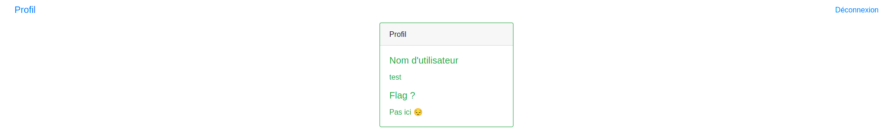
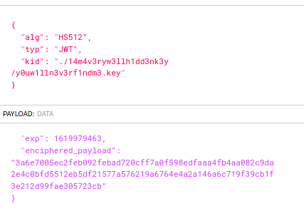
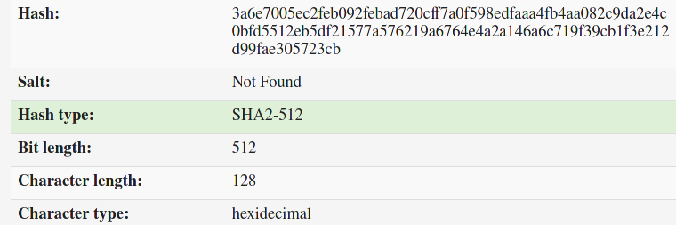
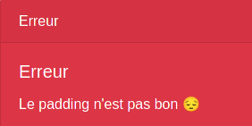
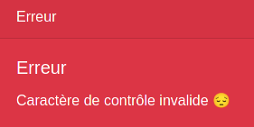
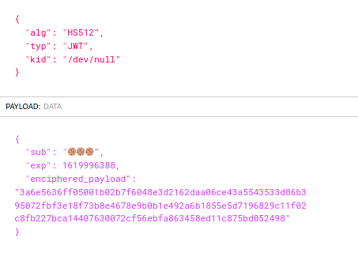
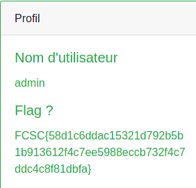

# Sacré jeton, toujours le token pour rire

## Auteur

Worty

### Description 

Démontrez à l'administrateur que le système d'authentification qu'il a mis en place sur son site est faillible en vous connectant en tant qu'admin. On vous fournit des identifiants de test : test/test.

http://challenges2.france-cybersecurity-challenge.fr:5004/

Note : aucune énumération de fichiers/comptes/mots de passe n'est nécessaire.

### Catégorie

Web - Crypto

### Solution

Dans ce challenge, on ne nous donne qu'un seul compte pour se connecter sur l'application : "test/test", on rentre donc cela dans le formulaire de connexion, et on arrive sur cette page :



Nous n'apprenons pas grand chose sur cette page, et le code source HTML ne contient pas d'informations qui pourraient nous aider. Vu le nom du challenge, on doit surement avoir un cookie qui nous ai attribué lors de la connexion. 

C'est le cas, on nous attribue un cookie "strange_cookie", qui est en fait un JSON Web Token (JWT). Je vais donc aller voir ce qu'il contient à l'aide de https://jwt.io :



Dans ce JSON Web Token, deux informations me sautent aux yeux :
- "kid"
- "enciphered_payload"
  
En effet, dans ce token, le key id fait référence à un fichier, j'ai d'abord essayé d'aller chercher ce fichier via l'application web, mais celle-ci renvoi un "404 Not Found", autrement dit, on ne pourra pas avoir le contenu de cette clé. 

Par contre, nous contrôlons le fichier qui va permettre de vérifier l'intégrité des données du token, il suffit donc de passer "/dev/null" à la place de "./14m4v3ryw3llh1dd3nk3y/y0uw1lln3v3rf1ndm3.key". Cela à pour effet que le token sera signé avec une chaîne de caractère vide. Je peux maintenant modifier le token à ma guise et l'application l'acceptera sans problème. 

De plus, nos informations de connexion doivent sûrement être contenues dans la variable "enciphered_payload".

Ma seconde réflexion à été d'identifier ce qu'étais "enciphered_payload", il m'a semblé reconnaître un hash, je suis donc allé sur https://www.tunnelsup.com/hash-analyzer/, pour en connaître la nature :



Cela ne m'a pas servi à grand chose, j'ai ensuite décidé de changer un des caractères présents dans enciphered_payload, de signer le token (avec une chaîne vide) et d'actualiser la page du challenge :



Cette erreur est très intéressante, en effet, selon mon hypothèse, nos informations (test/test) doivent être contenues dans enciphered_payload. Cette erreur de padding me fait penser que, enciphered_payload est en fait nos informations chiffrées avec l'algorithme AES (Advanced Encryption Standard).

Avec cette erreur de padding, je sais qu'il est possible de retrouver le plaintext qui a été chiffré avec AES. J'ai donc cherché un script sur internet capable de faire cela et j'ai trouvé cette [librarie](https://github.com/mwielgoszewski/python-paddingoracle) capable de réaliser l'attaque. 

J'ai dû modifier le script réalisant l'attaque car il envoyait directement l'AES, alors que pour nous, il est dans un JSON Web Token :

```py
from paddingoracle import BadPaddingException, PaddingOracle
from base64 import b64encode, b64decode
from urllib import quote, unquote
import requests
import socket
import time
import jwt
import sys
payload = {
    "sub": "🍪🍪🍪",
    "exp": 1619976113,
    "enciphered_payload": ""
}

class PadBuster(PaddingOracle):
    def __init__(self, **kwargs):
        super(PadBuster, self).__init__(**kwargs)
        self.session = requests.Session()
        self.wait = kwargs.get('wait', 2.0)

    def oracle(self, data, **kwargs):
        hexdata = ''.join('{:02x}'.format(x) for x in data)
        payload["enciphered_payload"] = hexdata
        strange = jwt.encode(payload,"",algorithm="HS512",headers={"kid":"/dev/null"}).decode()
        self.session.cookies['strange_cookie'] = strange

        while 1:
            try:
                response = self.session.get('http://challenges2.france-cybersecurity-challenge.fr:5004/',
                        stream=False, timeout=5, verify=False)
                break
            except (socket.error, requests.exceptions.RequestException):
                logging.exception('Retrying request in %.2f seconds...',
                                  self.wait)
                time.sleep(self.wait)
                continue

        self.history.append(response)

        if "padding" not in response.text:
            logging.debug('No padding exception raised on %r', data)
            return
        
        raise BadPaddingException


if __name__ == '__main__':
    import logging
    logging.basicConfig(level=logging.DEBUG)
    padbuster = PadBuster()
    strange = bytearray.fromhex("3a6e7005ec2feb092febad720cff7a0f598edfaaa4fb4aa082c9da2e4c0bfd5512eb5df21577a576219a6764e4a2a146a6c719f39cb1f3e212d99fae305723cb")

    cookie = padbuster.decrypt(strange, block_size=16, iv=bytearray(16))
    print('Decrypted strange_cookie: %r' % (cookie))
```

Ici, mon attaque n'était basée que sur une hypothèse : l'algorithme de chiffrement utilisé est l'AES en mode CBC. Cet algortihme fonctionne de la manière suivante :


Ici, grâce au message de l'application "erreur de padding", on peut donc réaliser une attaque "padding oracle", car l'erreur nous permet de différencier une erreur de padding d'une autre erreur.

Après plusieurs minutes, notre "padding oracle attack" nous retourne un résultat du plaintext:

```
bytearray(b'p3\xf8\x01\x86\x83\xbb\xed\x96|\x13{\x02R\xeb\xb463, "useless_header": "", "username": "test"}\x03\x03\x03')
```

Mon hypothèse de départ était donc correcte, il s'agit bien d'un algorithme de chiffrement AES en mode CBC. Dans ce plaintext, on voit que nos informations sont stockées sous forme JSON. J'ai commis ici ma première erreur, je me suis seulement concentré sur les attributs "useless_header" et "username".

Une fois le plaintext récupéré, je pouvais réaliser une attaque de type "bit flip", permettant de changer mon username de "test" à "admin". Comme on a pu le voir sur le schéma précédent, le mode CBC de l'AES fonctionne en bloc (ici de taille 16). Chaque bloc chiffré permet de xor le bloc suivant pour ensuite le passer dans l'algorithme de chiffrement. 

Tout d'abord, j'ai découpé enciphered_payload ainsi que le plaintext déterminé grâce à l'oracle en bloc de 32 bits:

```
3a6e7005ec2feb092febad720cff7a0f
598edfaaa4fb4aa082c9da2e4c0bfd55
12eb5df21577a576219a6764e4a2a146
a6c719f39cb1f3e212d99fae305723cb

p3\xf8\x01\x86\x83\xbb\xed\x96|\x13{\x02R\xeb\xb4
63, "useless_hea
der": "", "usern
ame": "test"}\x03\x03\x03
```

Ici, on observe qu'il y a 4 blocs, on va donc devoir modifier le troisième qui influe directement sur le résultat du 4ème, pour passer "test" à "admin" :

On va devoir modifier le bloc C3, en appliquant des opérations XOR sur le plaintext actuel, le plaintext que l'on souhaite obtenir ainsi que C3 :

C3' = C3 ^ m4 ^ m4', avec :<br>
- C3 = 12eb5df21577a576219a6764e4a2a146<br>
- m4 = ame": "test"}\x03\x03\x03<br>
- m4' = ame": "admin"}\x02\x02<br>

Pour réaliser cette opération j'ai créé un simple script :

```py
from pwn import xor
C3 = bytearray.fromhex("12eb5df21577a576219a6764e4a2a146")
m4 = b'ame": "test"}\x03\x03\x03'
m4_1 = b'ame": "admin"}\x02\x02'

print(xor(xor(C3,m4),m4_1).hex())
```

Le résultat de l'exécution nous donne une nouvelle valeur du bloc C3 : 12eb5df21577a56320847a28bbdca047. Pour vérifier que notre bit flip a bien marché, je vais rappeler l'oracle avec notre bloc C3 modifié :

```
p3\xf8\x01\x86\x83\xbb\xed\x96|\x13{\x02R\xeb\xb4
63, "useless_hea
\xb8\xafN\xdf\xa4!E\x8c\xec6\xa2\xa9\xa8A?\xf9
ame": "admin"}\x02\x02
```

Etant donné que l'on a modifié le bloc C3 (bit flip), il est maintenant composé de caractères illisibles, il va donc falloir réitérer l'opération mais cette fois ci sur le bloc C2, pour que le cleartext du bloc C3 redevienne ```der": "", "usern``` :

```py
from pwn import xor
C2 = bytearray.fromhex("598edfaaa4fb4aa082c9da2e4c0bfd55")
m3 = b'\xb8\xafN\xdf\xa4!E\x8c\xec6\xa2\xa9\xa8A?\xf9'
m3_1 = b'der": "", "usern'

print(xor(xor(C2,m3),m3_1).hex())
```

On obtient donc la nouvelle valeur du bloc C2 : 8544e3573afa2d0e42df5af2972fb0c2. On va modifier notre enciphered_payload, pour rappeler l'oracle dessus pour vérifier que notre bit flip a bien fonctionné, notre enciphered_payload (découpé par blocs) vaut :

```
3a6e7005ec2feb092febad720cff7a0f
8544e3573afa2d0e42df5af2972fb0c2
12eb5df21577a56320847a28bbdca047
a6c719f39cb1f3e212d99fae305723cb
```

Une fois le script exécuté, notre plaintext ressemble à :

```
p3\xf8\x01\x86\x83\xbb\xed\x96|\x13{\x02R\xeb\xb4
\x0ee\xfa\xdb\xf7\xd6\x0f=\xa6+\xa3$\xaa\x955@
der": "", "usern
ame": "admin"}\x02\x02
```

Et la ce pose un problème, le second bit flip a modifié la valeur du bloc C2, qui est maintenant devenu illisible, pour le modifier, il faudrait toucher au bloc C1, mais cela n'est pas envisageable car nous n'avons pas la valeur de l'IV. Il va donc falloir trouver un autre moyen pour pallier ce problème, en effet, si l'on essaye de remplacer la valeur de enciphered_payload par ce que nous avons calculé, l'application nous renvoie cette erreur :



Les caractères de contrôle sont des caractères spéciaux qui sont au nombre de 34, si un de ces caractères est présent dans notre enciphered_payload déchiffré, cela cassera le JSON et l'application nous renverra l'erreur ci-dessus. 

Il faut donc :
- Trouver un moyen de contenir notre chaine de caractères illisibles du au bit flip quelque part dans le JSON.
- Faire en sorte qu'il n'y est pas de caractère de contrôle dans notre JSON.

Je vous ai parlé de ma première erreur qui fût de ne voir dans le JSON que les attributs "username" et "useless_header". Après réflexion et en regardant de plus près le plaintext du premier oracle, je me suis rendu compte que dans le json était aussi stocké "exp" :

```
p3\xf8\x01\x86\x83\xbb\xed\x96|\x13{\x02R\xeb\xb4
63, "useless_hea
der": "", "usern
ame": "test"}\x03\x03\x03
```

En effet, si on regarde la deuxième ligne, elle commence par "63" comme la fin de "exp" dans la payload du JSON Web Token. Ma première approche a été la suivante :

- Refaire le bit flip de la deuxième étape pour non plus compléter le champ "useless_header", mais pour que les caractères illisibles ainsi que le début de la troisième ligne ```der": "",``` rentre dans la valeur de exp, pour que le json soit valide. Il faudra ensuite bruteforce pour faire en sorte qu'il n'y ait pas de caractère de controle pour ne pas casser le JSON.

Je refais donc mon deuxième bit flip qui une fois passé dans ma méthode pour recalculer le block ainsi que dans l'oracle donne :

```
p3\xf8\x01\x86\x83\xbb\xed\x96|\x13{\x02R\xeb\xb4
<GARBAGE OF 16 BYTES>
01234567, "usern
ame": "admin"}\x02\x02
```

Dans la deuxième ligne, on peut observer un caractère de controle (\x00), etant donné que je controle ce que je mets (au niveau de 01234567), je vais générer des strings aléatoires pour faire en sorte qu'il n'y est pas de caractère de controle. Après plusieurs bruteforce, je me suis rendu compte de mon erreur, le champ "exp" contient un int, comme on a pu le voir, or les caractères que je vais lui fournir ne sont pas forcément des int, mon approche n'est donc pas bonne et a très très peu de chance de réussir.

Ici, ce qui m'embête, c'est le "garbage" produit par mon deuxième bit flip, qui cause la non-validité du JSON. Je décide d'aller lire plusieurs Write Ups sur internet où il faut réaliser un bit flip, pour voir l'approche que les différents joueurs ont pu adopter. Après plusieurs lectures, un des Write ups à retenu mon attention, en effet, pour pallier ce problème de "garbage", une des approches était de rajouter un block, pour contenir le garbage dans une string. 

C'est ici que je me suis rendu compte de ma troisième erreur, je n'ai pas accordé d'importance au "useless_header", sauf qu'ici, il va m'etre bien utile pour faire en sorte que mon JSON soit valide. Mon approche est la suivante :

- Mettre le garbage causé par mon bit flip dans la définition du "useless_header" en rajoutant un block pour que le JSON ne soit pas cassé.

Mon plaintext aura donc cette forme-là :

```
p3\xf8\x01\x86\x83\xbb\xed\x96|\x13{\x02R\xeb\xb4
63, "useless_hea
<GARBAGE OF 16 BYTES>
   ": "", "usern
ame": "admin"}\x02\x02
```

Dans cet exemple, on voit bien que le garbage produit est encapsulé entre des doubles quotes. Il nous suffit donc de réitérer les précédentes opérations, puis de rajouter notre bloc "598edfaaa4fb4aa082c9da2e4c0bfd55" pour encapsuler le garbage dans des doubles quotes.

Une fois généré, on modifie notre JSON Web Token avec la nouvelle valeur de enciphered_payload et là... ca ne marche pas, "caractère de controle invalide". En effet, je n'ai pas pris le temps de regarder la valeur du plaintext avec l'oracle : il y avait un caractère de controle dans le garbage. J'ai simplement changé la valeur du quatrième bloc :

```
p3\xf8\x01\x86\x83\xbb\xed\x96|\x13{\x02R\xeb\xb4
63, "useless_hea
<GARBAGE OF 16 BYTES>
  a": "", "usern
ame": "admin"}\x02\x02
```

Avec de la chance, il n'y aura pas de caractère de controle. Je repasse donc notre nouvelle valeur dans enciphered payload :



On change ensuite la valeur de notre JSON Web Token :



## Flag

FCSC{58d1c6ddac15321d792b5b1b913612f4c7ee5988eccb732f4c7ddc4c8f81dbfa}