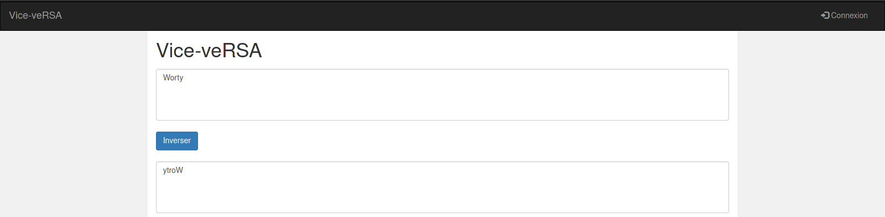
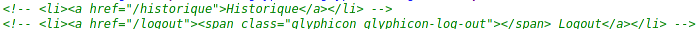
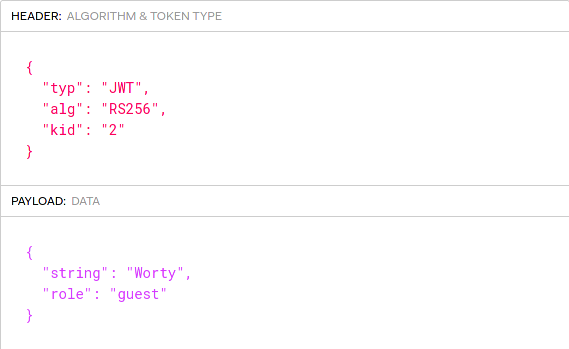
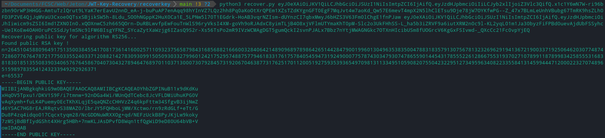
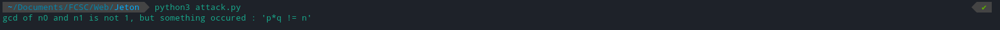
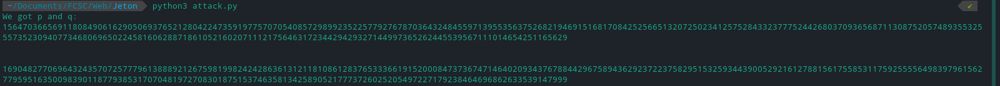
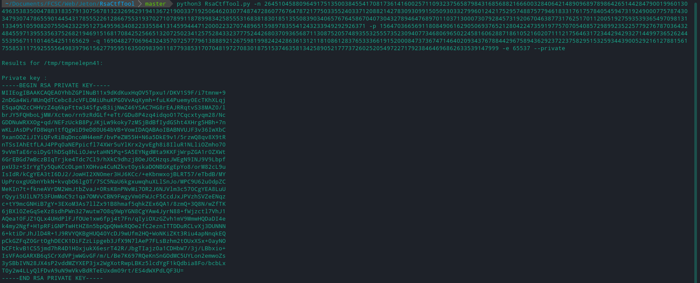
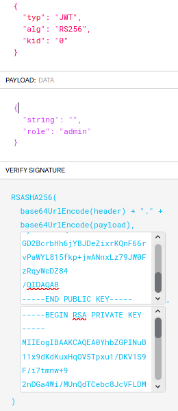
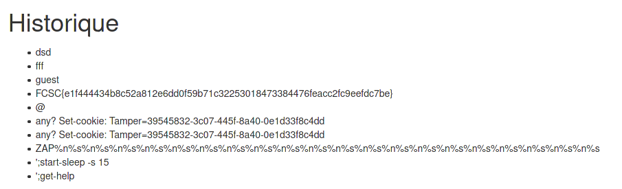

# Vice - veRSA

## Auteur

Worty


### Description 

L'administrateur se cache bien d'indiquer aux utilisateurs que leurs messages sont enregistrés. Prouvez-lui qu'on ne peut pas la faire à l'envers aux utilisateurs.

http://challenges2.france-cybersecurity-challenge.fr:5003

### Catégorie

Web - Crypto

### Solution

Quand on arrive sur le challenge, on peut simplement inverser une chaîne, rien de très intéressant :



On peut aussi tenter de se connecter, mais des credentials basiques comme "admin/admin" - "admin/password" ne fonctionnent pas. Mon premier réflexe est de regarder le code source de la page HTML, dedans, on peut voir une information intéressante : 



Vu l'énoncé du challenge, on se doute que les messages des utilisateurs sont enregistrés et visibles sur /historique. Malheureusement, cette page n'est accessible que par un administrateur, il va donc falloir trouver un moyen de le devenir.

Après avoir joué un peu avec l'application, je décide de regarder si celle-ci m'attribue un cookie, et c'est le cas, c'est un JSON Web Token (JWT). Je vais directement sur https://jwt.io pour voir ce qu'il contient :



On voit donc que la string qui a été passée à l'application est contenue dans le JWT, elles sont bien sauvegardées à notre insu ! Vilain admin !

Dans notre JSON Web Token, on remarque que l'algorithme "RS256" est utilisé pour vérifier l'intégrité des données qui se trouvent dedans. On ne peut donc pas directement passé notre rôle de "guest" à "admin", il va nous falloir la clé qui permet de signer ce token.

Notre objectif est donc on ne peut plus clair, nous devons retrouver la clé privée qui permet de signer le token pour passer notre rôle de "guest" à "admin" pour accéder à l'historique.

En jouant un peu avec l'application et en vérifiant le contenu des tokens à chaque fois, je me suis rendu compte que celui-ci était resigné avec la même clé quand on passait une string pour l'inverser. On aura donc deux tokens différents, mais signés avec la même clé. Grâce à cet [outil](https://github.com/FlorianPicca/JWT-Key-Recovery), on peut retrouver la clé publique ainsi que "n" et "e" :



Une autre chose m'intrigue dans le challenge, c'est le "kid". Pour les JWT le "kid" représente le "key id", ici, il peut prendre trois valeurs : "0","1" et "2". J'en ai rapidement déduit qu'il y avait 3 clés. Je décide de réitérer l'opération précédente sur les trois clés.

Finalement, il y a trois "n" différents:

- 26451045880964917513500384554170817361416002571109323756587984316856882166600328406421489096897898642651442847900199601304963538350047883183579130756781323269629194136721900337192506462030774874728607767647872177503355240337120882142783093099150509303327996012421752957488757794618331761757840545947319249000775787430347930747865590144543178555226128667553193702710789911878998342585553168381830185135508390340657676458670407304327894647689701103713000730792845731920670463877317625170112005192759353936549709813113349510590820755042322951273495963408223355841314599444712000223270748965159897835541243233949292926371
<br>

- 23665652820134805374198160670285833921391080168347242686789486999501147452564182203815403432586037211580956807418390515260607797114130600470792877974783209468301203025857100674184179834125773001492324249995631518632190591284347199695615566699061802073984938509524118604141487334019736930099338674532167272834445210127085946363143475338489425347697379610470637836163978122048233036129066473971261891100314946785632986774865922264847742332593870916133974536065637794870077767216697298265895973548680864568583117925623450171604556505682160596979527747518700282565884296112666999750704513275226624446992913735981325611673
<br>

- 22731365669722716790523988469211174698469647719778831863970396221572599409300719240441972167971859096690301602182969197363505496123904858731217310323069800081347653770883702578911025506738080849436708669671186348533493041292769716064576663922411644860482974431829677048235872088045298198687332564790708320625966491365742866664943328632514191628724244741007713325357654856556937713627169871880861184843650059723398603225879352578010649653414401635886489704537350073827506117761008999068169633867812485790098429368696301604341046865861665894241805556589392944953338821552542037920683039404461145689037243695687228406013

Après avoir cherché sur internet et avec mes connaissances, la seule attaque possible pouvant correspondre à ce challenge (de mon point de vue) est "Common Factor Attack", en effet, si l'on calcule le plus grand commun diviseur de nos différents "n" et qu'il est différent de 1, cela peut correspondre au nombre "p" qui a permis de générer la clé privée. Je créé donc un petit script permettant de faire cela : 

```python
def gcd(num1, num2):
        if num1 < num2:
                num1, num2 = num2, num1
        while num2 != 0:
                num1, num2 = num2, num1 % num2
        return num1

n0 = 26451045880964917513500384554170817361416002571109323756587984316856882166600328406421489096897898642651442847900199601304963538350047883183579130756781323269629194136721900337192506462030774874728607767647872177503355240337120882142783093099150509303327996012421752957488757794618331761757840545947319249000775787430347930747865590144543178555226128667553193702710789911878998342585553168381830185135508390340657676458670407304327894647689701103713000730792845731920670463877317625170112005192759353936549709813113349510590820755042322951273495963408223355841314599444712000223270748965159897835541243233949292926371
n1 = 23665652820134805374198160670285833921391080168347242686789486999501147452564182203815403432586037211580956807418390515260607797114130600470792877974783209468301203025857100674184179834125773001492324249995631518632190591284347199695615566699061802073984938509524118604141487334019736930099338674532167272834445210127085946363143475338489425347697379610470637836163978122048233036129066473971261891100314946785632986774865922264847742332593870916133974536065637794870077767216697298265895973548680864568583117925623450171604556505682160596979527747518700282565884296112666999750704513275226624446992913735981325611673

p = gcd(n0,n1)
if p != 1:
    q = n0/p
    if(p*q == n0):
        print("We got p and q:")
        print(p)
        print("\n")
        print(q)
    else:
        print("gcd of n0 and n1 is not 1 but something occured : 'p*q!=n'")
else:
    print("gcd(n0/n1) is equal to 1...")
```



Comme vous pouvez le voir, le gcd de n0 et n1 est différent de 1, mais p0*q0 est différent de n0, autrement dit, ce ne sont pas les bons paramètres. Je décide donc pour ca de regarder la sortie du script, pour afficher les valeurs de p et q.

Ici, p paraît "normal", mais q est sous forme de puissance (1.6904827706964323e+308), ce qui fausse donc notre résultat puisque python fait une approximation, le problème est identifié. Il va donc falloir trouver une lib en python permettant de gérer les très grands nombres. Après de rapides recherches sur internet, je trouve une librarie s'appelant "decimal", le script final ressemble à cela :

```python
from decimal import Decimal, getcontext
getcontext().prec = 2**16
def gcd(num1, num2):
        if num1 < num2:
                num1, num2 = num2, num1
        while num2 != 0:
                num1, num2 = num2, num1 % num2
        return num1

n0 = Decimal(26451045880964917513500384554170817361416002571109323756587984316856882166600328406421489096897898642651442847900199601304963538350047883183579130756781323269629194136721900337192506462030774874728607767647872177503355240337120882142783093099150509303327996012421752957488757794618331761757840545947319249000775787430347930747865590144543178555226128667553193702710789911878998342585553168381830185135508390340657676458670407304327894647689701103713000730792845731920670463877317625170112005192759353936549709813113349510590820755042322951273495963408223355841314599444712000223270748965159897835541243233949292926371)
n1 = Decimal(23665652820134805374198160670285833921391080168347242686789486999501147452564182203815403432586037211580956807418390515260607797114130600470792877974783209468301203025857100674184179834125773001492324249995631518632190591284347199695615566699061802073984938509524118604141487334019736930099338674532167272834445210127085946363143475338489425347697379610470637836163978122048233036129066473971261891100314946785632986774865922264847742332593870916133974536065637794870077767216697298265895973548680864568583117925623450171604556505682160596979527747518700282565884296112666999750704513275226624446992913735981325611673)

p = Decimal(gcd(n0,n1))
q = Decimal(n0/p)
if(p*q == n0):
    print("We got p and q:")
    print(p)
    print("\n")
    print(q)
```



On retrouve donc nos paramètres p et q, permettant de générer la clé privée qui signera le token ! Pour générer la clé privée, je vais me servir de RsaCTFTool :



Il ne nous reste maintenant plus qu'à générer le token qui nous permettra de voir ce fameux historique, pour cette étape, je suis retourné sur https://jwt.io, pour modifier mon token avec la clé publique récupérée auparavant, ainsi que la clé privée que je viens de calculer :



Avec notre nouveau token, il suffit de le remplacer dans notre navigateur et ensuite accéder à /historique :



## Flag

FCSC{e1f444434b8c52a812e6dd0f59b71c32253018473384476feacc2fc9eefdc7be}